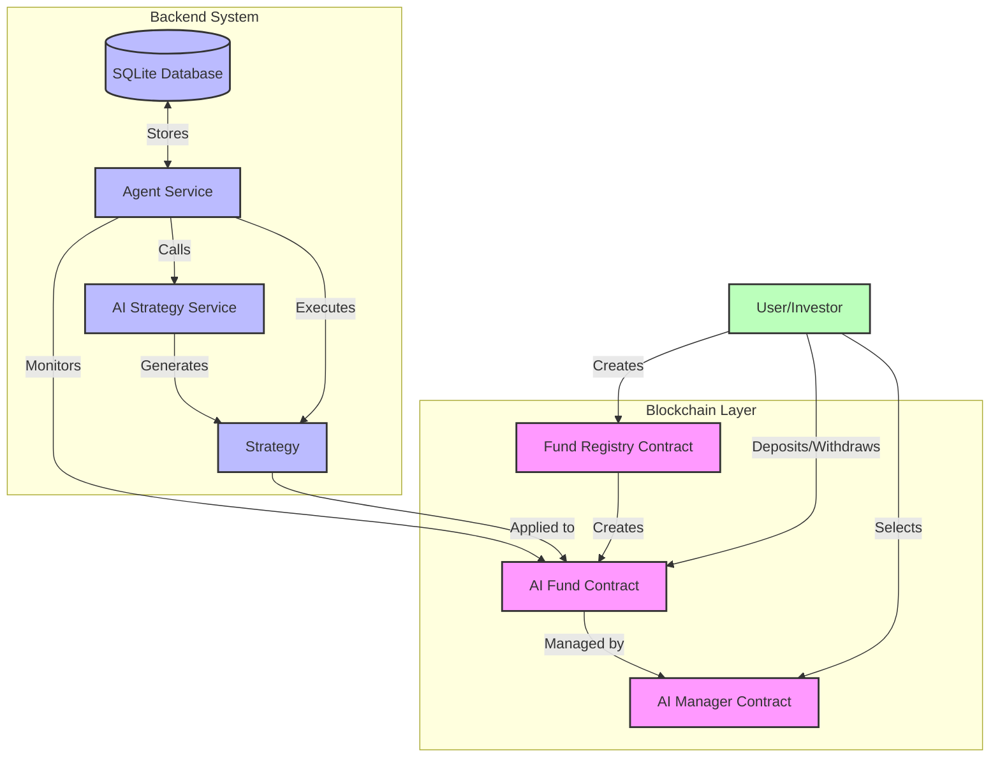

# AI Fund Manager

AI-powered hedge fund manager for blockchain assets that automatically manages funds based on AI-generated investment strategies.



## Features

- Monitors blockchain for new funds assigned to managed AI strategies
- Automatically generates investment strategies using AI
- Executes strategies on-chain through smart contracts
- Tracks fund performance and history
- Simple SQLite database for storing fund data

## Setup

1. Clone the repository
2. Install dependencies: `npm install`
3. Copy `.env.example` to `.env` and fill in required values
4. Create data directory: `mkdir -p data`
5. Start the service: `npm start`

## Environment Variables

- `RPC_URL`: Ethereum RPC endpoint URL
- `PRIVATE_KEY`: Private key for executing transactions
- `REGISTRY_ADDRESS`: Address of the fund registry contract
- `MANAGER_ADDRESSES`: Comma-separated list of AI manager contract addresses
- `OPENAI_API_KEY`: API key for OpenAI services
- `CHECK_INTERVAL_MINUTES`: Interval for checking new funds (default: 60)
- `EXECUTE_INTERVAL_HOURS`: Interval for executing strategies (default: 24)

## Project Structure

```
.
├── data/                  # Database files
├── logs/                  # Log files
├── src/
│   ├── db/                # Database utilities
│   │   ├── repositories.js  # Data access layer
│   │   └── setup.js        # Database setup
│   ├── services/          # Core services
│   │   ├── agent.js       # Main agent service
│   │   ├── ai-strategy.js # AI strategy generation
│   │   └── blockchain.js  # Blockchain interaction
│   ├── utils/             # Utility functions
│   │   ├── config.js      # Configuration
│   │   ├── helpers.js     # Helper functions
│   │   └── logger.js      # Logging setup
│   └── index.js           # Application entry point
└── package.json           # Project configuration
```

## License

ISC
